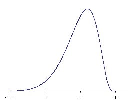

# Sampling distribution of r

The distribution of the correlation value r of repeated samples is the sampling distribution of [r](Pearson%20correlation.md).

## Shape

Sampling distribution of r can be skewed since values of r cannot exceed 1 or -1. Thus a mean closer to the boundary of r will produce a larger skew.

## Solving for probability

Since the curve is not necessarily normal, we need to apply Fisher's z' formula to calculate the probability.

$$z'=0.5\ln[(1+r)(1-r)]$$
$$\sigma=\frac{1}{\sqrt{N-3}}$$
Once we have converted $X$ and $\mu$ to their respective z' values, we apply [standard normal distribution formula](Standard%20normal%20distribution.md#Formula) to calculate the z value.